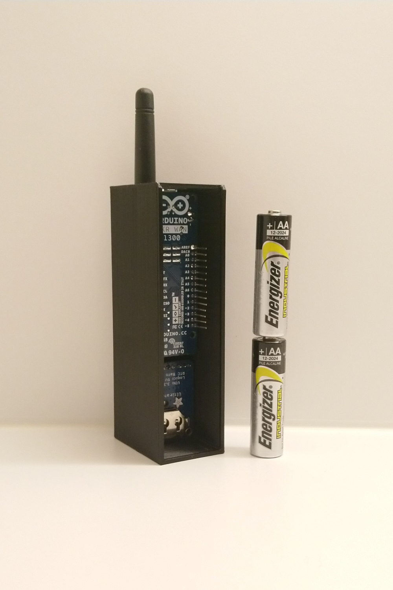

# Arduino-LoRaTracker
Arduino based GPS tracker using LoRa network.

**Work in progress**

You will need access to a LoRa network and put in the appropriate values for the network in question for OTAA connectivity.  
The tracker will continously read from the GPS and every 10 minutes it will send a message over LoRa containing a status code and the last coordinates recorded. (Only for short period testing.)

This is not a finished product. Since it continuosly reads the GPS a pair of AA batteries will only last a few hours at best. Also note that messages sent using this are not (yet) encrypted so someone could potentially intercept messages.

# Bill of materials
* Mainboard w/ modem: Arduino ABX00017 MKR WAN 1300  
* GPS Module: Adafruit 746 Ultimate GPS Breakout
* Antenna u.Fl.(800-900MHz): SRPASSIVES GSM-ANT403 / Linx Technologies ANT-868-PML-UFL  
* Jumper wires + optional breadboard

# Hardware configuration
Solder the headers to the GPS board and connect it to the MKR board. The GPS has a passive built-in antenna. An active antenna could be considered for better performance.  
* GPS VIN.........MKR VCC  
* GPS GND.........MKR GND  
* GPS RX..........MKR TX (14)  
* GPS TX..........MKR RX (13)  
* GPS ENABLE......MKR PIN0  
* GPS FIX.........MKR PIN1  
* GPS PPS........ MKR PIN2  
Connect the UFL antenna to the MKR WAN board.  

# Software configuration
Install Arduino IDE and upload the code.  

# Message protocol
7 byte fixed length message. Should work nicely with all LoRa networks. Limit is sometimes 51 bytes while the LoRa specification maximum is 222 bytes.  
Message format:  
```<status><latitude><longitude>```  
"status" is a single ASCII charachter, value from 64 (@) to 127 (DEL).  
"latitude" and "longitude" are the location coordinates originally as decimal degree values (-DDD.dddd) with 4 decimal digits (11m precision) but for transmission they are transformed as:  
Float latitude/longitude (values + 180)*10000 cast to integers. The +180 addition eliminates the need for a negative sign. The integers are split into three 8-byte parts. The bytes are concatenated to a char[] (String).  Each of the coordinate parts is represented by 3 bytes while the status is a single byte, making the message a total of 7 bytes.  
```[status_byte][latitude_byte1][latitude_byte2][latitude_byte3][longitude_byte1][longitude_byte2][longitude_byte3]```  

## Status codes
One byte long, least significant 6 bits are used for statuses. Add an offset of 64 and interpret as a ASCII char.
```
MSB--<0><OFFSET><ACTIVE><GPS><ACCEL><FENCE><TAMP><BATT>--LSB
<0>         0. Not used.

<OFFSET>    0. Offset only when sending message to avoid overflow.

<ACTIVE>    1 = Active mode triggered by accelerometer, geofence or request
            0 = Default 
            
<GPS>       1 = GPS fix
            0 = No GPS fix
            
<ACCEL>     0 = Normal accelerometer readings
            1 = Accelerometer treshold exceeded, tracker is moving
            
<FENCE>     0 = Inside geofence  
            1 = Outside geofence, alarm  
            
<TAMP>      0 = Default, no tampering detected
            1 = Physical tampering detected
            
<BATT>      0 = Battery Normal
            1 = Battery Low Alarm
            
Example message:
GPS active, normal message: B01010000 = P
GPS active, outside of geofence: B01011000 = X
Active mode due to tampering, GPS lost, battery low: B01100011 = c
```

# 3D-printed box
For a more rigid setup than a breadboard, one can solder wires and fit the tracker into a nice and compact 3D-printed case as can be seen in the picture below. A complete model with lid and battery insert is under construction.  

